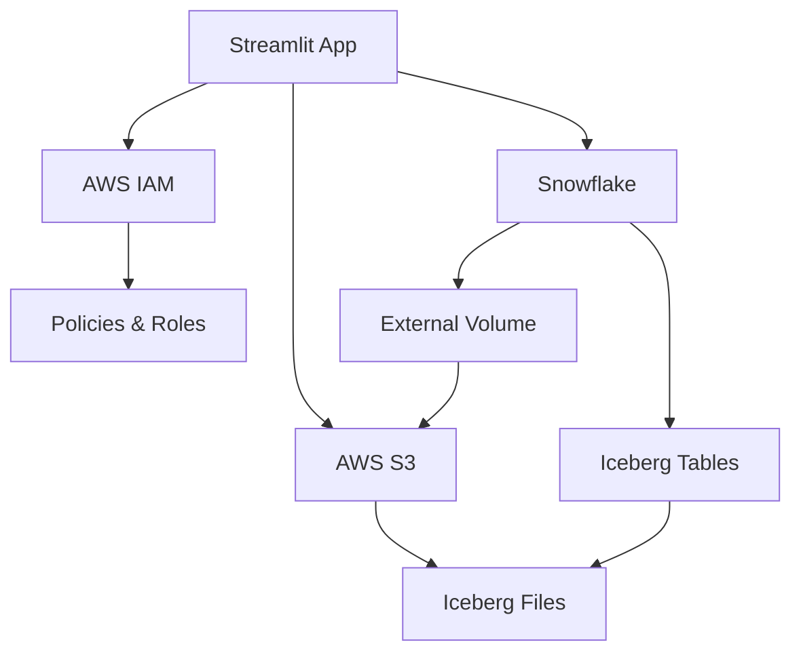

# 🧊 Iceberg Table Creator

**Automate Iceberg Table creation on Snowflake with AWS S3 storage - Zero manual setup required!**

Transform hours of manual AWS console clicking and Snowflake configuration into a beautiful, automated workflow. Create production-ready Iceberg tables with just a few clicks.


## ✨ What This Does

This app completely automates the complex process of setting up Iceberg tables on Snowflake:

### **🏗️ Infrastructure Setup (Automated)**
- ✅ Creates AWS S3 bucket for Iceberg storage
- ✅ Creates IAM policy with precise permissions  
- ✅ Creates IAM role with dynamic trust policy
- ✅ Creates Snowflake External Volume
- ✅ Extracts Snowflake credentials automatically
- ✅ Updates IAM trust policy with Snowflake credentials

### **🧊 Table Creation (One-Click)**
- ✅ Create unlimited Iceberg tables using existing infrastructure
- ✅ Built-in templates (Stock Data, User Data, Sales Data)
- ✅ Custom column definitions with 23+ data types
- ✅ Automatic test data insertion and validation
- ✅ S3 file verification
- ✅ Complete table management

## 🚀 Quick Start (5 Minutes)

### **Prerequisites**
- Python 3.8+ installed
- AWS account with programmatic access
- Snowflake account

### **1. Clone & Install**
```bash
git clone https://github.com/rrprasan/Iceberg_Table_Creator.git
cd Iceberg_Table_Creator
chmod +x install.sh
./install.sh
```

### **2. Configure Connections**

**AWS Credentials** (`~/.aws/credentials`):
```ini
[default]
aws_access_key_id = YOUR_ACCESS_KEY_ID
aws_secret_access_key = YOUR_SECRET_ACCESS_KEY
```

**Snowflake Connection** (`~/.snowflake/connections.toml`):
```toml
[DEMO_PRAJAGOPAL_PUBLIC]
account = "YOUR_ACCOUNT"
user = "YOUR_USERNAME"
password = "YOUR_PASSWORD"
database = "YOUR_DATABASE"
schema = "YOUR_SCHEMA"
```

### **3. Run the App**
```bash
streamlit run Iceberg_Table_Creator.py
```

🎉 **Open http://localhost:8501 and start creating Iceberg tables!**

## 📋 Detailed Setup Guide

### **AWS Setup**

1. **Create AWS User** with programmatic access
2. **Attach Policies**:
   - `AmazonS3FullAccess`
   - `IAMFullAccess` 
   - `STSAssumeRoleAccess`
3. **Save credentials** to `~/.aws/credentials`

### **Snowflake Setup**

1. **Get Connection Details**:
   - Account identifier (e.g., `ABC12345.us-west-2.aws`)
   - Username and password
   - Default database and schema

2. **Required Permissions**:
   - `ACCOUNTADMIN` role (or sufficient privileges)
   - Ability to create external volumes
   - Ability to create databases/schemas/tables

3. **Save to** `~/.snowflake/connections.toml`

## 🛠️ Usage

### **Infrastructure Setup**
1. Open the app → **Infrastructure Setup** tab
2. Fill in your AWS and Snowflake details
3. Click **"Setup Infrastructure"**
4. Watch the magic happen! ✨

The app will automatically:
- Create S3 bucket in your chosen region
- Set up IAM policies and roles
- Create Snowflake External Volume
- Configure trust relationships

### **Creating Tables**
1. Switch to **Create Tables** tab
2. Choose database and schema
3. Pick a template or create custom columns
4. Click **"Create Iceberg Table"**
5. Watch your table get created, tested, and verified! 🎉

## 🏗️ Architecture



## 📁 Project Structure

```
Iceberg_Table_Creator/
├── Iceberg_Table_Creator.py    # Main Streamlit app
├── requirements.txt            # Python dependencies
├── install.sh                 # One-command installer
├── run.sh                     # One-command launcher
├── README.md                  # This file
├── CURSOR_PROMPTS.md          # AI-assisted development guide
├── DEPLOYMENT.md              # Multiple deployment options
├── .gitignore                # Git ignore rules
├── Dockerfile                # Docker deployment
├── docker-compose.yml        # Easy Docker setup
├── LICENSE                   # MIT license
├── .github/workflows/        # CI/CD automation
└── docs/                     # Additional documentation
    ├── TROUBLESHOOTING.md    # Common issues & solutions
    ├── EXAMPLES.md           # Real-world usage examples
    └── ...                   # More documentation
```

## 🔧 Configuration Options

### **AWS Regions Supported**
- `us-east-1`, `us-east-2`, `us-west-1`, `us-west-2`
- `eu-west-1`, `eu-west-2`, `eu-west-3`, `eu-central-1`, `eu-north-1`
- `ap-southeast-1`, `ap-southeast-2`, `ap-northeast-1`, `ap-northeast-2`, `ap-south-1`
- `ca-central-1`, `sa-east-1`, `af-south-1`, `me-south-1`

### **Supported Data Types**
- **Text**: VARCHAR, STRING, TEXT
- **Numeric**: INTEGER, BIGINT, SMALLINT, TINYINT, DECIMAL, NUMERIC, DOUBLE, FLOAT, REAL
- **Boolean**: BOOLEAN
- **Date/Time**: DATE, TIME, DATETIME, TIMESTAMP, TIMESTAMP_LTZ, TIMESTAMP_NTZ, TIMESTAMP_TZ
- **Binary**: BINARY, VARBINARY
- **Semi-Structured**: VARIANT, OBJECT, ARRAY

## 🎨 Templates

### **Stock Data Template**
Perfect for financial data analysis:
- TICKER (VARCHAR)
- TRADE_DATE (DATE)
- OPEN_PRICE (DOUBLE)
- HIGH_PRICE (DOUBLE)
- LOW_PRICE (DOUBLE)
- CLOSE_PRICE (DOUBLE)
- VOLUME (BIGINT)

### **User Data Template**
Ideal for user management systems:
- USER_ID (INTEGER)
- USERNAME (VARCHAR)
- EMAIL (VARCHAR)
- CREATED_DATE (TIMESTAMP)
- IS_ACTIVE (BOOLEAN)

### **Sales Data Template**
Great for e-commerce analytics:
- ORDER_ID (INTEGER)
- CUSTOMER_ID (INTEGER)
- PRODUCT_NAME (VARCHAR)
- QUANTITY (INTEGER)
- PRICE (DECIMAL)
- ORDER_DATE (DATE)

## 🚨 Troubleshooting

### **Common Issues**

**"Connection not found"**
- Check `~/.snowflake/connections.toml` format
- Ensure connection name matches exactly

**"AWS credentials not configured"**
- Verify `~/.aws/credentials` exists
- Check AWS access key permissions

**"S3 bucket creation failed"**
- Bucket names must be globally unique
- Try a different bucket name

**"IAM role creation failed"**
- Ensure your AWS user has IAM permissions
- Check for existing roles with same name

### **Getting Help**
- 📖 Check [TROUBLESHOOTING.md](docs/TROUBLESHOOTING.md)
- 🐛 [Open an issue](https://github.com/rrprasan/Iceberg_Table_Creator/issues)
- 💬 [Start a discussion](https://github.com/rrprasan/Iceberg_Table_Creator/discussions)

## 🤖 AI-Assisted Development

Want to recreate this app or understand how it was built? Check out **[CURSOR_PROMPTS.md](CURSOR_PROMPTS.md)** - a complete guide with the exact prompts used to build this application with AI assistance.

### **What's Included:**
- 📝 **Sequential prompts** for each development phase
- 🔧 **Problem-solving approaches** for common issues
- 🏗️ **Architecture decisions** and reasoning
- 🎯 **Best practices** for AI-assisted development
- 📚 **Learning outcomes** from the development process

Perfect for:
- **Learning** Streamlit and AWS/Snowflake integration
- **Understanding** AI-assisted development workflows
- **Recreating** similar applications for your use case
- **Contributing** enhancements to this project

## 🤝 Contributing

We love contributions! Here's how to help:

1. **Fork** the repository
2. **Create** a feature branch (`git checkout -b feature/amazing-feature`)
3. **Commit** your changes (`git commit -m 'Add amazing feature'`)
4. **Push** to the branch (`git push origin feature/amazing-feature`)
5. **Open** a Pull Request

### **Development Setup**
```bash
git clone https://github.com/rrprasan/Iceberg_Table_Creator.git
cd Iceberg_Table_Creator
python -m venv venv
source venv/bin/activate  # On Windows: venv\Scripts\activate
pip install -r requirements.txt
streamlit run Iceberg_Table_Creator.py
```

### **AI-Assisted Development**
```bash
# Use the prompt guide to recreate or enhance
open CURSOR_PROMPTS.md
# Follow the sequential prompts with your AI assistant
```

## 📜 License

This project is licensed under the MIT License - see the [LICENSE](LICENSE) file for details.

## 🙏 Acknowledgments

- **Streamlit** for the amazing web app framework
- **Snowflake** for Iceberg table support
- **AWS** for reliable cloud infrastructure
- **Apache Iceberg** for the open table format

## 🌟 Star History

[](https://star-history.com/#rrprasan/Iceberg_Table_Creator&Date)

---

**Made with ❤️ for the data community**

*Transform your data infrastructure setup from hours of frustration to minutes of pure joy!* ✨

## 📞 Contact
- 💼 LinkedIn: [Your LinkedIn](https://www.linkedin.com/in/prasannarajagopal/)

---

**Happy table creating!** 🧊✨
